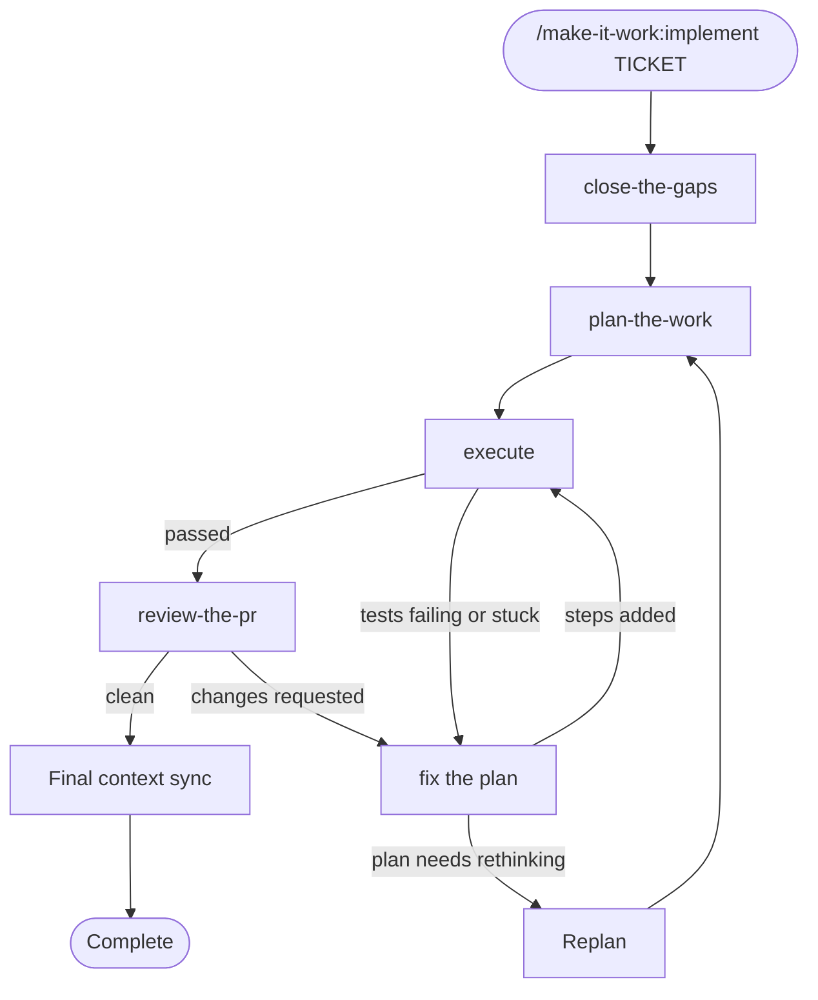

# make-it-work

> From idea to delivery: make your codebase AI-ready with context skills, shape requirements, slice work, plan implementation, review changes against the requirements and codebase guidance — or orchestrate the whole flow for a ticket with `implement`.

Built for engineering teams working on large, complex codebases. Not greenfield side projects. When your codebase has history, domain rules, and legacy decisions baked in, "generally smart" isn't enough. Claude needs to know *your* project.

## The problem

Claude reads code well. But on a large, long-lived codebase it misses things - domain rules buried in old commits, implicit constraints never documented, business logic spread across layers. It guesses. The bigger the repo, the worse it gets.

`make-it-work` solves this at the source.

## How it works

### `/make-it-work:go-deep`

`go-deep` maps your codebase and builds a structured knowledge base that Claude loads before doing any work:

- **How and what** (always loaded) - two rule files: `architecture.md` is the *how* (domains, components, code areas), `product.md` is the *what* (use cases, actors, business rules).
- **Skills** (loaded on demand) - one per functional domain, one per use case. Each skill is a precise, minimal description of one area of your code - enough for Claude to navigate, not so much it bloats the context.

**The cross-reference map**

Every domain skill points to the use cases it affects. Every use case skill points to the domains it touches. Claude uses these cross-references automatically - when planning a feature it follows links to understand which domains are involved; when planning tests it traces which use cases are affected by a domain change, covering progression and regression without you having to map it out.

**Context efficiency**

Skill descriptions are written to be minimal but precise. Claude reads the description and decides whether to load the skill - it never pulls in unneeded information. The bigger the codebase, the more this matters: Claude gets exactly the context it needs for the task at hand, nothing more. No hallucinating, no misunderstanding, whether planning or executing.

**Staying in sync**

Part of what `go-deep` builds is a hard enforcement rule in CLAUDE.md: before every commit, Claude checks whether any skill or doc needs updating. New domain? Create the skill. Existing domain changed? Update it. Nothing ships without the knowledge base staying in sync with the code.

Run `go-deep` once when you onboard a project.

**What the code can't tell you**

During `go-deep`, Claude asks targeted questions so the how and what files capture what can't be learned from reading the code alone - giving Claude the full picture of the project, not just its structure.

The questioning phase reveals what Claude misunderstands about your code - surfacing domain concepts not obvious from reading files, business rules that live only in developers' heads, and assumptions baked into the architecture that were never written down. Answering those questions produces documentation no static analysis tool can generate: the *why* behind the *what*.

The skills produced are also useful outside Claude Code. Product managers can read domain and use case skills to understand what the system actually does, making them a live source of truth for writing requirements.

---

### `/make-it-work:define-test-strategy`

`define-test-strategy` bootstraps a per-project test strategy and an initial regression baseline: a `.claude/rules/testing-strategy.md` file documenting the project's test layers, a coverage decision tree, and example commands per layer, plus scaffolded placeholder tests for the confirmed-uncovered critical flows from `go-deep`'s use-case list. It establishes a UC/domain test-tagging convention with a re-runnable coverage-check mode, so you can re-invoke it later to see which use cases or domains still have no mapped tests, and it wires enforcement into the project's `CLAUDE.md` — adding a regression-check item to the "After Any Feature Change" checklist, with an optional git hook offered on top.

Run it once per project, right after `go-deep` — the same way `go-deep` itself is run once to bootstrap the knowledge base. It requires `go-deep` to have already run in the target project: if it hasn't, the skill stops and tells you to run `go-deep` first.

---

### `/make-it-work:run-regression`

`run-regression` runs a project's regression suite - the full suite, or scoped to specific domains and use cases named from `go-deep`'s vocabulary (e.g. `domain-velocity`, `UC-08`). It discovers the full-suite command from `define-test-strategy`'s generated `.claude/rules/testing-strategy.md` when that file exists, falling back to `package.json`/`Makefile`/CI discovery otherwise - the same way `plan-the-work` already discovers build and lint commands. Scaffolded placeholder tests never block a run, and results are reported live in chat, with nothing persisted to disk.

Use it directly during day-to-day development to check a change against the regression suite, full or scoped. It's also the shared implementation `execute` calls as its completion gate at the end of a plan, instead of writing its own test-running logic.

---

### `/make-it-work:shape-the-epic`

Acts as a senior product coach to help you write a complete, elaboration-ready epic for any work management tool (Jira, Azure DevOps, Linear, Shortcut). Runs five structured phases — context ingestion, discovery interview, internal analysis, criterion-by-criterion validation, and epic generation — covering value proposition, target users & permissions, KPIs, use cases with Gherkin acceptance criteria, rollout plan, and definition of done.

Use it when writing or improving a product epic, fleshing out a feature idea for engineering, or whenever you need to turn a rough concept into a spec that's ready for elaboration.

---

### `/make-it-work:slice-the-epic`

Slices a requirement, epic, ticket, or user story into small, independently deliverable increments, and writes each slice as a proper Gherkin (Given/When/Then) user story. Picks a slicing technique (functional, workflow, data, user role, or technical-risk slicing), sizes each slice to half a sprint or less, and orders them by risk.

Use it when a ticket or epic feels too big and needs to become sprint-sized stories. Tell Claude things like "this ticket is too large," "break this into smaller pieces," or "help me write user stories for this epic," or invoke it directly with `/make-it-work:slice-the-epic`.

---

### `/make-it-work:find-the-repos`

`find-the-repos` shortlists which repo(s) in a multi-repo workspace a ticket actually affects, before that ticket has even been assigned to one. It matches the ticket against each candidate repo's `product.md` — or, for a purely technical ticket with no business-logic content to match, each repo's `architecture.md` instead — and reports the result as **definite** and **possible** confidence tiers, never silently dropping a possible match in favor of a single "best" answer. It presents the draft shortlist — which you can adjust — and waits for your explicit confirmation before saving it.

Unlike the fixed `close-the-gaps → plan-the-work → execute → review-the-pr` pipeline, `find-the-repos` ships standalone: nothing else in this plugin calls it yet. Run it on its own, before that pipeline starts, whenever a ticket's home repo isn't already obvious.

---

### `/make-it-work:close-the-gaps`

`close-the-gaps` acts as a Product Analyst before development begins. It loads the project skills relevant to the ticket, digs into the affected code, and surfaces every gap - unclear language, missing edge cases, conflicting requirements, unstated assumptions - then walks you through them one question at a time. It can also run in an **offline mode** — export every question to a file to answer outside the session, then re-invoke pointing at that file to inject the answers and resume — for when the person who can answer isn't available live.

The output is a Gherkin-ready refined spec. Unknown unknowns become explicit. Requirements are solid before a single line of code is written.

Teams use it before refinement meetings so developers arrive with focused questions rather than discovering gaps mid-discussion. Or post the output directly to the Jira ticket for product to review asynchronously - no meeting needed for straightforward tickets.

The cost of a vague ticket is paid in rework. `close-the-gaps` closes the gaps before the first line of code.

---

### `/make-it-work:plan-the-work`

Turns an agreed spec or refined ticket into an execution-ready implementation plan before any production code is written. It loads the project's guidance and relevant skills, investigates the real code paths across one or more repositories, closes technical and scoping gaps with you, and writes an atomic, verifiable plan to `make-it-work/<TICKET>-plan.md`. When the target project has a test framework configured, it also writes and confirms each step's progression (red) and regression (currently-passing) tests — including minimal, clearly-marked stub signatures on a typed or dynamic stack where needed to reach a valid runtime red state — and commits them onto the plan's branch; projects with no test framework configured are unaffected.

Pass a ticket ID or a spec path, or let the skill derive the ticket from the current branch. Use it after `close-the-gaps` and before implementation so another engineer or agent can execute the work step by step without guessing.

---

### `/make-it-work:execute`

Implements a plan `plan-the-work` already wrote, step by step: it writes each step's code, re-runs that step's tests until they pass with a 5-attempt retry limit before asking for help, and halts the whole plan - rather than guessing - whenever a failing test looks like a real product-behavior question instead of a test bug. Once every step is green, it runs `run-regression` as a completion gate — full-suite today, with the groundwork in place for a future scoped mode once plans record which domains/use-cases they touch — and stops for your triage on a gate failure instead of trying to auto-fix it. It never commits on your behalf, leaving all finished work in the working tree for you to review.

Pass a ticket ID or a path to a plan file, or let the skill derive the ticket from the current branch. Use it after `plan-the-work` to turn an execution-ready plan into actual code, completing the `close-the-gaps` → `plan-the-work` → `execute` → `review-the-pr` pipeline.

---

### `/make-it-work:review-the-pr`

Acts as a reviewer grounded in the project's own documentation instead of generic intuition. Runs three passes - business correctness against the `uc-*` skills, regression safety against the `domain-*` skills and architectural constraints, and coding standards against `CLAUDE.md` - then a docs-sync check to confirm skills were updated alongside behavior. Emits a verdict-first, evidence-dense report, both as a pasteable file and a scannable chat summary.

Use it to review a pull request or diff in any repo that keeps the `go-deep` knowledge base (`CLAUDE.md` plus `uc-*`/`domain-*` skills and `.claude/rules` docs).

---

### `/make-it-work:implement`

Orchestrates the whole pipeline for one ticket: it checks that the project has its `go-deep` context, then runs `close-the-gaps` → `plan-the-work` → `execute` → `review-the-pr`, and finishes by syncing the project's skills and rules files with what was actually built. It stays thin — each stage skill keeps owning its own reasoning; `implement` decides what runs next, reads each stage's outcome, and enforces the loop limits.



You choose the autonomy level at the start. **Guided** pauses for your approval after the spec and after the plan. **Autonomous** skips those approval gates and replans on its own when the plan stops holding. In both, every question a stage asks still comes to you. A self-deciding level is planned for a later release.

When review asks for fixes, or the final regression run breaks a test tied to the ticket's own requirements, the fixes are added to the plan as new test-first steps, and execution continues from there. Regressions unrelated to the ticket are documented in the summary, not fixed. A project without an automated test suite can continue with the plan's manual test walkthrough instead. Fix rounds are capped at 3 and reviews at 5 per plan version, and replans at 2 per run, so a run never loops indefinitely.

Progress is saved to `make-it-work/<TICKET>-state.md` at every step, so running `implement` again resumes where it stopped — and if the repository changed in the meantime, it shows you what changed instead of assuming it's still safe to continue. Alongside it, a per-ticket progress dashboard (`make-it-work/<TICKET>-status.html`) is created when a run starts and refreshed at every checkpoint, so you can see the run's phase, cycle counts, transition history, and — whenever it's waiting on you — what to do next, without reading the raw state file. It asks before starting on the base branch — offering to create a feature branch for you, proceed anyway, or stop — never commits implementation changes, never pushes, and never opens a PR; the only commits a run contains are `plan-the-work`'s own red-state test commits.

Use it when you want one command to take a ticket from request to a reviewed, documented implementation, in a repo that has been onboarded with `go-deep`.

---

## Keep improving

When Claude gets something wrong, don't just correct it - ask why it missed. What was unclear in the skills or rules? Update them so it doesn't happen again. Every misunderstanding is a chance to make the knowledge base more accurate. Over time the system gets sharper, not stale.

---

## Usage

```
/make-it-work:go-deep                        # Scaffold full project docs from scratch
/make-it-work:define-test-strategy           # Bootstrap a test strategy and regression baseline once per project
/make-it-work:run-regression [full | domain-<name> | UC-<id> ...]  # Run the regression suite, full or scoped
/make-it-work:shape-the-epic                 # Write a complete epic from scratch or improve an existing one
/make-it-work:slice-the-epic                 # Slice a large requirement into sprint-sized Gherkin user stories
/make-it-work:find-the-repos TICKET-123  # Shortlist which repo(s) in a multi-repo workspace a ticket affects
/make-it-work:close-the-gaps TICKET-123      # Refine a ticket by ID
/make-it-work:close-the-gaps                 # Paste ticket content directly
/make-it-work:close-the-gaps TICKET-123 --offline            # Export gap-analysis questions to a file instead of asking live
/make-it-work:close-the-gaps make-it-work/TICKET-123-questions.md  # Resume and inject answers from that file
/make-it-work:plan-the-work TICKET-123       # Turn a refined spec into an implementation plan
/make-it-work:plan-the-work path/to/spec.md  # Plan from an explicit local spec
/make-it-work:execute [TICKET-ID | path/to/plan.md]  # Execute a plan step by step, then run the completion gate
/make-it-work:review-the-pr                  # Review a PR against the project's own skills and CLAUDE.md
/make-it-work:implement TICKET-123           # Run the whole pipeline for a ticket, with saved state
/make-it-work:implement path/to/spec.md      # Start the pipeline from an existing spec
/make-it-work:implement                      # Resume an in-progress implement run
```

## Requirements

- [Claude Code](https://code.claude.com/docs/en/overview), installed and authenticated.
- A project workspace, ideally a Git repository. `go-deep`, `define-test-strategy`, and `review-the-pr` inspect the repository's code and documentation. `plan-the-work` does the same and, when a test framework is configured in the target project, also writes and commits per-step progression and regression test files onto the plan's branch.
- For ticket IDs such as `TICKET-123`, a separately installed and configured issue-tracker integration. You can always paste the ticket content instead.

`review-the-pr` is most effective after `go-deep` has created the project's `CLAUDE.md`, `.claude/rules` documentation, and domain/use-case skills.

## Install

Choose one installation channel. Installing the plugin from both marketplaces can make it unclear which copy Claude Code is loading.

### Anthropic community marketplace

Use the community marketplace for the curated distribution. Community catalog updates may lag behind a new upstream release; use the InsideOut AI marketplace when you need the newest publisher release immediately.

```text
/plugin marketplace add anthropics/claude-plugins-community
/plugin install make-it-work@claude-community
```

### InsideOut AI marketplace

Use the publisher's marketplace for the direct upstream distribution:

```text
/plugin marketplace add insideout-ai/make-it-work
/plugin install make-it-work@insideout-ai
```

Reload Claude Code after installation if the skills do not appear immediately:

```text
/reload-plugins
```

## Update

Update the marketplace metadata first, then update the plugin from the same channel you used to install it.

Community marketplace:

```text
/plugin marketplace update claude-community
/plugin update make-it-work@claude-community
```

InsideOut AI marketplace:

```text
/plugin marketplace update insideout-ai
/plugin update make-it-work@insideout-ai
```

Run `/reload-plugins` or restart Claude Code after updating.

## Example workflows

Onboard an established repository, create its project knowledge base, and bootstrap its test strategy:

```text
/make-it-work:go-deep
/make-it-work:define-test-strategy
```

Turn a rough feature idea into an elaboration-ready epic, then split it into independently valuable stories:

```text
/make-it-work:shape-the-epic Add delegated account access for enterprise customers
/make-it-work:slice-the-epic
```

In a multi-repo workspace, shortlist which repo a ticket belongs to before refining it:

```text
/make-it-work:find-the-repos TICKET-123
/make-it-work:close-the-gaps TICKET-123
```

Refine a ticket, then turn the agreed spec into an implementation plan:

```text
/make-it-work:close-the-gaps TICKET-123
/make-it-work:plan-the-work TICKET-123
/make-it-work:execute TICKET-123
```

Run a scoped regression check against the domain you're actively working on:

```text
/make-it-work:run-regression domain-velocity
```

Review the current pull request against the repository's documented product behavior and architecture:

```text
/make-it-work:review-the-pr
```

Run the whole pipeline for a ticket, from refinement to a reviewed, context-synced implementation:

```text
/make-it-work:implement TICKET-123
```

## Data access and permissions

This plugin contains Markdown-based skills. It does not bundle executable scripts, hooks, MCP servers, or telemetry. When you invoke a skill, Claude may read files in the current project and may propose or write project documentation and review artifacts as part of that workflow; `run-regression` additionally runs the target project's own already-configured test command via Bash.

Unlike the other pipeline skills, which only read code and write review/planning artifacts under `make-it-work/`, `define-test-strategy` also writes directly into the target project itself: it generates `.claude/rules/testing-strategy.md`, scaffolds placeholder test files into the project's existing test directories, and edits the project's `CLAUDE.md` (its "Rules Files" list and "After Any Feature Change" checklist). If you opt in to its optional hook offer, it additionally writes a git hook file into the project's hook-manager location (e.g. `.husky/` or `.git/hooks/`) that runs the full test suite before every commit or push.

`plan-the-work` also writes directly into the target project itself when a test framework is configured there: it writes per-step progression and regression test files — including minimal, clearly-marked stub signatures where needed to reach a valid runtime red state — and commits them onto the plan's own branch (never pushed to a remote). Projects with no test framework configured are unaffected; `plan-the-work` falls back to its prior behavior of only writing planning artifacts under `make-it-work/`.

`execute` goes further still: unlike `define-test-strategy` and `plan-the-work` above, which write test files (and, for `plan-the-work`, commit them) but never the production code itself, `execute` writes the actual production code changes directly into the target project and runs its test commands via Bash by invoking `run-regression` — but, unlike `plan-the-work`, it never runs `git commit` on the user's behalf; every change it makes is left uncommitted for you to review.

Unlike skills that only read files in the current project, `find-the-repos` also reads `product.md` — and, for a purely technical ticket, `architecture.md` — from sibling repos elsewhere in the workspace. It writes only its own `make-it-work/<TICKET>-repos.md` artifact; it never modifies any repo's code or docs.

`implement` changes the target project only through the stages it runs — `plan-the-work`'s test commits, `execute`'s uncommitted implementation — plus its own final context sync, which writes the project's skills and `.claude/rules` files directly. `close-the-gaps` and `plan-the-work` may also write those files directly at the end of a run, but only to record facts about the system as it already is, never the ticket's planned behavior.

Issue-tracker access is not included in this plugin. Looking up a ticket by ID requires a separate integration that you install and authorize; pasting the ticket content requires no issue-tracker connection.

Pipeline artifacts (`make-it-work/<TICKET>-spec.md`, `<TICKET>-questions.md`, `<TICKET>-plan.md`, `<TICKET>-review.md`, `find-the-repos`'s `<TICKET>-repos.md`, and `implement`'s `<TICKET>-state.md`, `<TICKET>-status.html`, `<TICKET>-execute-report.md`, and versioned `<TICKET>-plan-v<N>.md` replans) are working documents, not deliverables — add `make-it-work/` to your project's `.gitignore` so they're never committed by accident. If a project was onboarded with `go-deep`, its generated `CLAUDE.md` also reminds Claude to flag a ticket's stale artifacts for deletion right after that ticket's code is committed.

## Troubleshooting

- **A skill is not available:** run `/reload-plugins` or restart Claude Code, then confirm the plugin is enabled with `/plugin`.
- **Claude Code loads an older version:** update both the marketplace and the plugin using the commands above, then reload plugins.
- **A ticket ID cannot be found:** configure an issue-tracker integration or invoke `close-the-gaps` without an ID and paste the ticket content.
- **An offline questions file is stuck pending:** re-invoke `close-the-gaps` with that file's path to inject the answers and resume, or invoke the ticket again and choose to overwrite it and start fresh.
- **`plan-the-work` cannot find a refined spec:** pass an explicit spec path or run `close-the-gaps TICKET-123` first to create `make-it-work/TICKET-123-spec.md`.
- **`review-the-pr` cannot find project guidance:** run `go-deep` first, or confirm the repository contains the expected `CLAUDE.md`, `.claude/rules`, and domain/use-case skills.
- **`implement` says the project context is incomplete:** run `/make-it-work:go-deep` and choose its "Repair existing docs" mode, then run `implement` again.
- **`implement` stopped mid-run:** read the stop reason in chat, in `make-it-work/<TICKET>-state.md` (`pause_reason`), or in `make-it-work/<TICKET>-status.html`'s "Waiting on you" section, address it, and run `implement` again — it resumes from the saved phase.
- **The plugin is installed twice:** remove or disable one copy in `/plugin` and keep the marketplace channel you want to follow.

If the problem persists, [open a GitHub issue](https://github.com/insideout-ai/make-it-work/issues) with your Claude Code version, installation channel, and the relevant error message.

See [SUPPORT.md](SUPPORT.md) for support and feature-request guidance. Report suspected vulnerabilities privately by following [SECURITY.md](SECURITY.md).

## Development

Validate the manifest, bundled skills, and marketplace entry before opening a pull request:

```sh
claude plugin validate .claude-plugin/plugin.json --strict
claude plugin validate skills --strict
claude plugin validate .claude-plugin/marketplace.json --strict
```

See [CONTRIBUTING.md](CONTRIBUTING.md) for local testing and pull-request guidance.

---

Built by [insideout-ai](https://github.com/insideout-ai)
